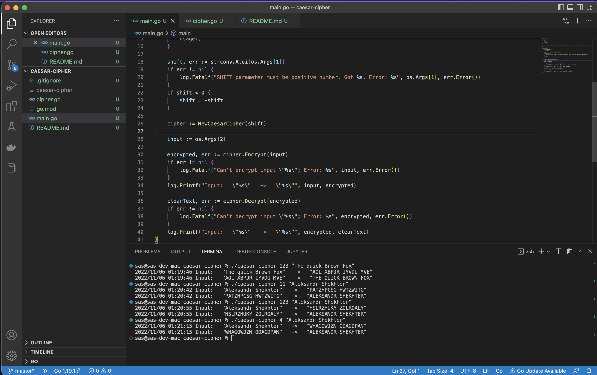

# IMPLEMENTATION OF THE CAESAR CIPHER

Simple implementation of the **Caesar Cipher** only for ASCII letters. We are losing case of the letters during encryption.

## HOW TO BUILD

```go build```

## HOW TO RUN

```
./caesar-cipher 10 "Let's check how it is working..."
```

## SCREENSHOTS



